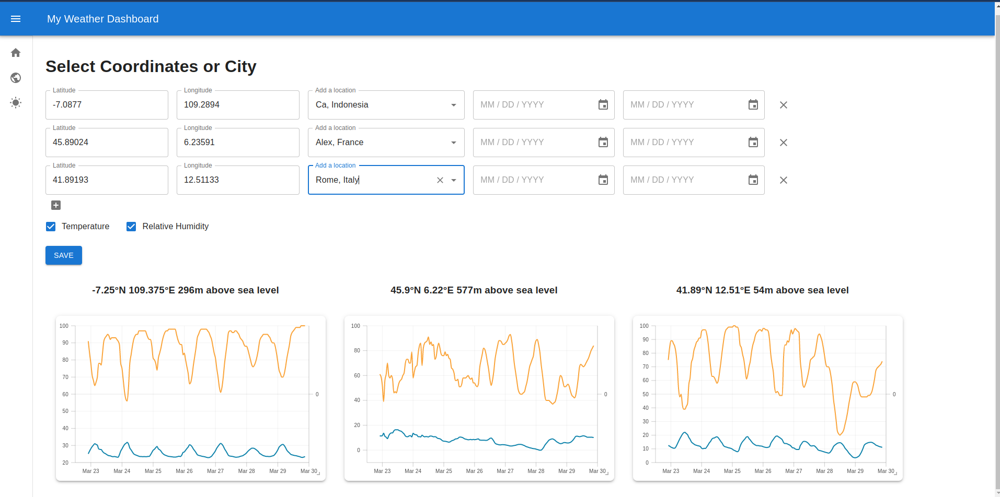
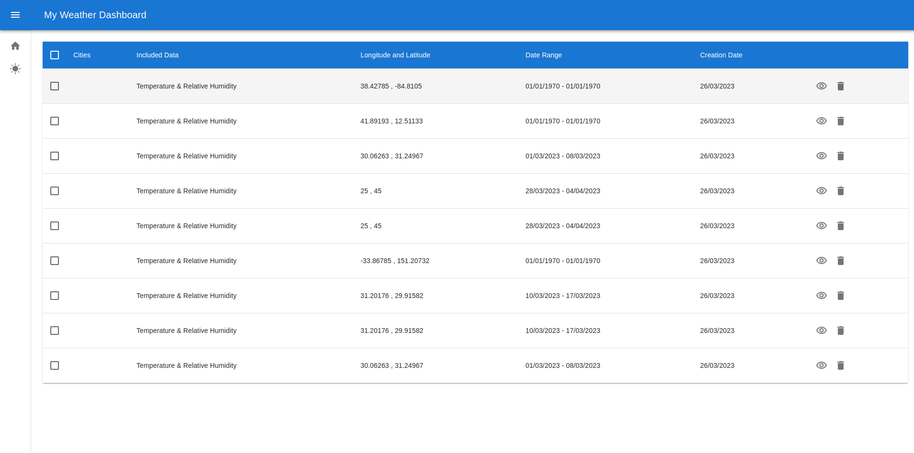

# Weather Dashboard

A dashboard to display the weather for a given location. The dashboard is built using React, TypeScript and https://open-meteo.com/en/docs weather API.

## Features
- The dashboard has two main pages:
  - The home page displays the weather for the selected city
  - Reports page to display reports saved by the user

### Home

One the home page, the user can:
- Search for a city
- Select a city from the list of cities
- View the weather for the selected city, within a specified time range
- Save the weather report for the selected city
- View weather by Latitude and Longitude
- Specify to view temperature and/or humidity values on the chart

### Reports

On the reports page, the user can:
- View all saved reports
- View the weather for a specific report
- Delete a report
- Delete a group of reports by selecting the reports and right-clicking on the table

### User Interface
- All components use the Material UI library for styling and responsiveness. 
- Charts are rendered using the React-chart library
- 
## Getting Started
    
### Prerequisites
- node v16 or higher
- yarn v1.22 or higher

### Installing
- Clone the repository
- Run `yarn install` to install dependencies
- Run `yarn start` to start the development server

## Available Scripts

In the project directory, you can run:

### `yarn start`

Runs the app in the development mode.\
Open [http://localhost:3000](http://localhost:3000) to view it in your browser.

The page will reload when you make changes.\
You may also see any lint errors in the console.

### `tsc`

Runs the TypeScript compiler to check for type errors.
